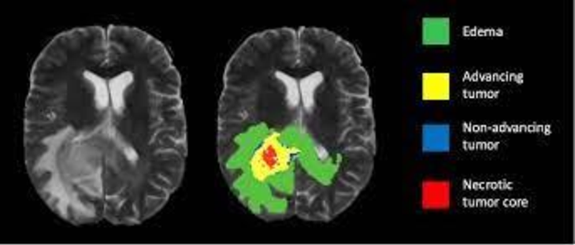
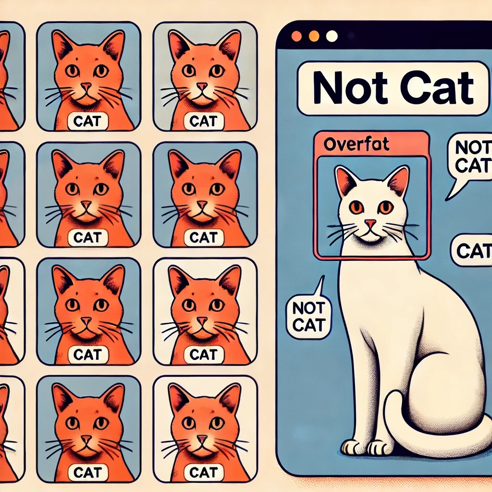

# Комп'ютерний зір: Методичні матеріали

# Що таке комп'ютерний зір?

Комп'ютерний зір (Computer Vision) — це галузь штучного інтелекту, яка займається обробкою, аналізом та інтерпретацією зображень і відео за допомогою комп'ютерних алгоритмів. Основна мета комп'ютерного зору — навчити машини розуміти візуальну інформацію так само (або навіть краще), як це робить людина.

Комп'ютерний зір базується на алгоритмах машинного навчання та глибокого навчання, які дозволяють автоматично витягати особливості зображень та аналізувати їх. До основних технологій комп'ютерного зору належать:
- Обробка зображень (фільтрація, покращення якості, перетворення форматів)
- Виявлення об'єктів
- Класифікація зображень
- Сегментація зображень
- Розпізнавання облич
- Відстеження об'єктів
- 3D-реконструкція сцен

## Приклади завдань комп'ютерного зору

### 1. Розпізнавання об'єктів
   - Виявлення автомобілів на дорозі (автономні автомобілі)
   - Ідентифікація людей у відеоспостереженні
     

### 2. Класифікація зображень
   - Визначення породи тварин на фото
   - Автоматичне сортування фотографій у галереї за категоріями

### 3. Сегментація зображень
   - Відокремлення органів у медичних знімках
   - Визначення меж об'єктів у супутникових знімках

### 4. Відстеження об'єктів у відео
   - Моніторинг руху автомобілів у місті
   - Аналіз поведінки покупців у супермаркеті

### 5. Оптичне розпізнавання символів (OCR)
   - Автоматичне зчитування номерних знаків
   - Розпізнавання рукописного тексту

## Проблеми в комп'ютерному зорі

Хоча комп'ютерний зір досяг значного прогресу, існує низка проблем, які впливають на ефективність та точність алгоритмів.

### 1. Високі обчислювальні витрати
Обробка зображень та відео вимагає значних обчислювальних ресурсів, особливо при використанні глибоких нейронних мереж. Це призводить до:
- Повільної роботи алгоритмів на слабкому обладнанні
- Високого споживання пам'яті та обчислювальної потужності

### 2. Недостатність даних для тренування
Моделі комп'ютерного зору потребують великих обсягів якісних даних для навчання. Проблеми:
- Обмеженість анотованих наборів даних
- Використання погано анотованих або незбалансованих даних може погіршити точність

### 3. Залежність від умов зйомки
Комп'ютерний зір чутливий до змін у навколишньому середовищі:
- Освітлення (наприклад, зображення можуть бути занадто темними або засвіченими)
- Кут огляду камери
- Шум та артефакти на зображенні

### 4. Низька узагальненість моделей
Багато моделей добре працюють у лабораторних умовах, але показують низьку точність у реальних сценаріях через:
- Домінування певних характеристик у навчальних даних
- Неможливість коректного аналізу нових варіантів об'єктів

